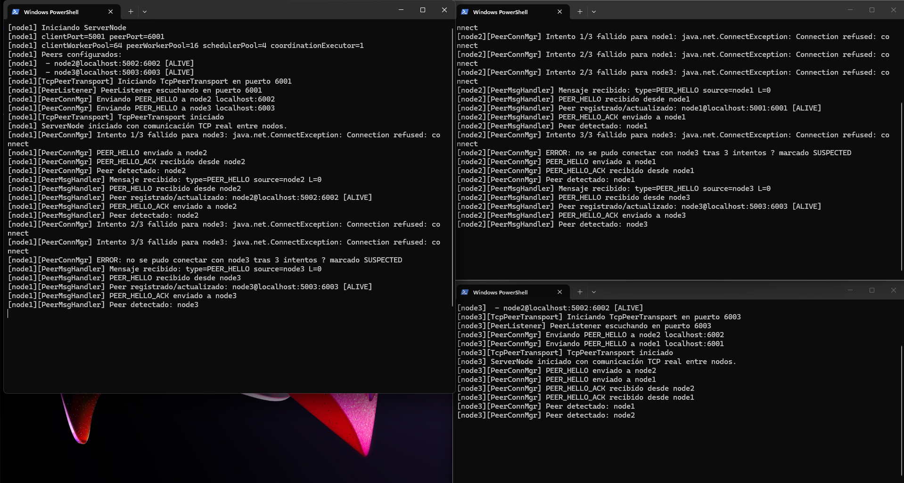

# Mini-handoff — Persona 2 

## Benjamin Leiva

**Módulo trabajado:** Comunicación entre nodos, sockets TCP y membresía (capa `server/peer`).

## Clases creadas

- `whatsapp.server.peer.TcpPeerTransport` — implementación real de `PeerTransport`, orquesta listener + conexiones salientes.
- `whatsapp.server.peer.PeerListener` — escucha conexiones entrantes de otros nodos en `peerPort`.
- `whatsapp.server.peer.PeerConnectionManager` — envía mensajes salientes (PEER_HELLO, broadcast, mensajes de Persona 3/4/5) y mantiene la cola de mensajes entrantes pendientes (`incomingQueue`).
- `whatsapp.server.peer.PeerMessageHandler` — procesa cada conexión entrante (un Runnable por conexión, ejecutado en `peerWorkerPool`).
- `whatsapp.server.messages.MembershipUpdateMessage` — mensaje serializable para propagar cambios de membresía entre nodos.

## Clases modificadas

- `whatsapp.server.core.ServerNode` — reemplaza `NoOpPeerTransport` (placeholder de Persona 1) por `TcpPeerTransport` real.
- `whatsapp.server.peer.PeerTransport` *(contrato de Persona 1)* — se agregó el método `NodeMessage pollIncoming()`. Cambio aditivo, no rompe ningún método existente.
- `whatsapp.server.peer.NoOpPeerTransport` *(de Persona 1)* — se implementó `pollIncoming()` retornando `null`, requerido por el cambio anterior en la interfaz.

## Correcciones aplicadas tras revisión (registradas en `FIXES-revision-claude.md`)

1. **Race condition de arranque:** el `ServerSocket` del `PeerListener` se abre de forma síncrona (`openServerSocket()`) antes de lanzar el accept-loop y antes de enviar cualquier `PEER_HELLO`.
2. **Starvation del pool:** el accept-loop del `PeerListener` corre en un `Thread` dedicado (daemon), no dentro de `peerWorkerPool`, liberando los 16 hilos del pool para procesar mensajes.
3. **Acceso a `incomingQueue` sin cast:** se agregó `pollIncoming()` al contrato `PeerTransport`, accesible desde `ServerNodeContext.getPeerTransport().pollIncoming()`.
4. **Código muerto:** se eliminó el `case PEER_HELLO_ACK` inalcanzable en `PeerMessageHandler` (el ACK siempre se lee en la misma conexión saliente).
5. **Ruido en logs:** el `ObjectOutputStream` de respuesta se crea de forma perezosa, solo para los tipos que responden (`PEER_HELLO`, `HEARTBEAT`).

## Qué requisito de la pauta cubre

- **2.1 Topología multinodo:** tres o más nodos en procesos/JVMs distintos, sin servidor único centralizando coordinación; se conocen vía membresía (PEER_HELLO/ACK).
- **4.4 Distribución y Comunicación (10%):** sockets TCP entre nodos + marshalling de objetos complejos (`NodeInfo`, listas de peers, mensajes tipados serializables) + mecanismo de descubrimiento/membresía funcionando.

## Captura o evidencia

